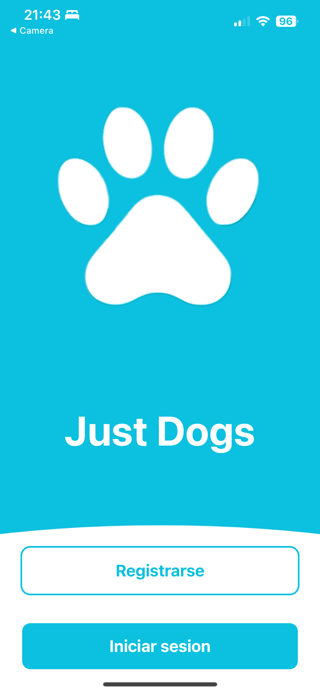
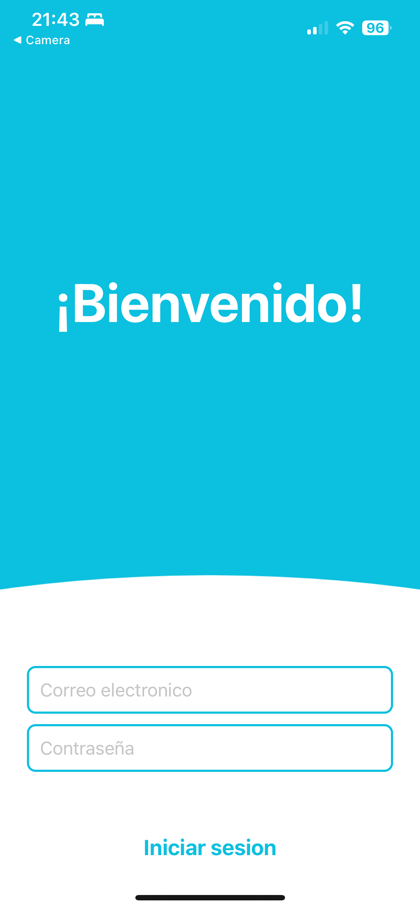
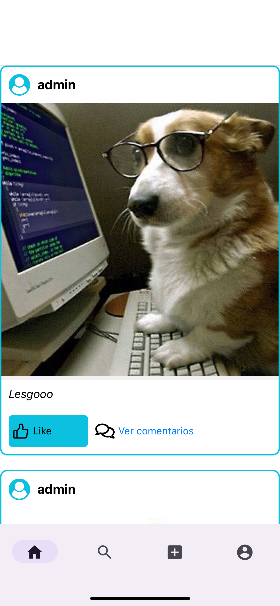
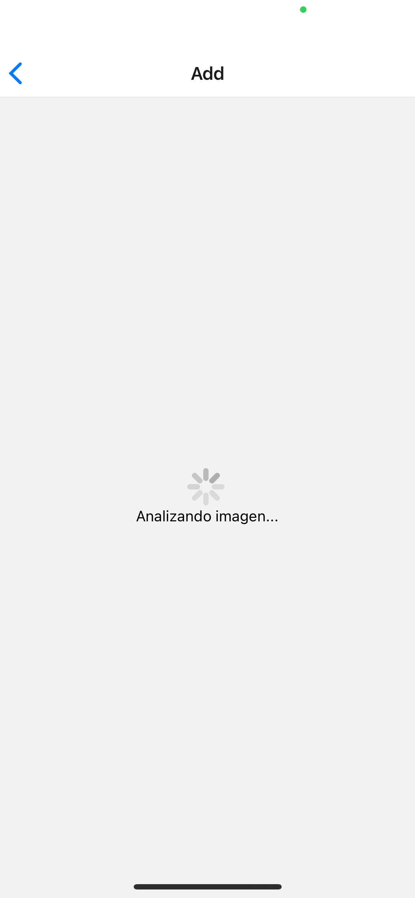
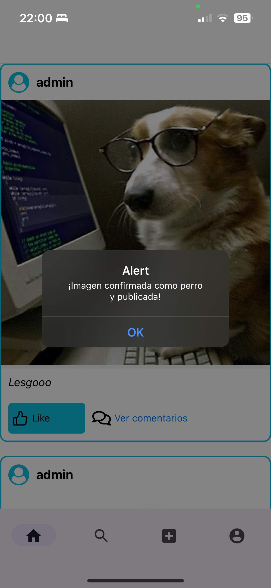
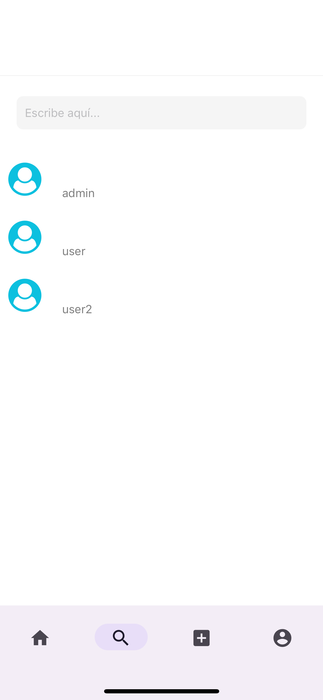

# 🐕 Just Dogs App 🐕

<div align="center">
    
</div>

## 📖🐶 Description

Just Dogs is a mobile application dedicated to dog lovers. Inspired by regular social networks, this app is a niche social network where users can share and view photos of dogs. The unique feature of this app is its use of machine learning to recognize and feature only dog pictures, ensuring a focused and delightful experience for canine enthusiasts.

## 🖼️🐾 Screenshots

<table>
  <tr>
    <td><br>Landing</td>
    <td><br>Login</td>
    <td><br>Feed</td>
    <td><br>Analizyng</td>
  </tr>
  <tr>
    <td><br>Approved</td>
    <td><br>Not Approved</td>
    <td><br>Profile</td>
    <td><br>Search</td>
  </tr>
</table>

## 🛠️🐕 Requirements

- React Native
- Expo
- Redux
- Node.js
- Firebase
- Machine Learning API for dog recognition

### 1. Clone Repo 📥

```bash
git clone https://github.com/KimRuedasR/Just-Dogs.git
```

### 2. Install Dependencies 📦

- Navigate to the project directory and run:

```bash
npm install
```

## 3. Firebase Setup 🔥

- For Firebase integration, create a `.env` file in your project root folder and add your Firebase configuration keys in the format `EXPO_PUBLIC_API_FIREBASE_API_KEY="your_key"`, etc.
- In your app, access these keys via `process.env.EXPO_PUBLIC_API_FIREBASE_API_KEY` and similar for other Firebase settings.
- Ensure `.env` is added to `.gitignore` to keep your keys secure.

### 4. Start the App with Expo 🌟

Run the React project with npm in the

```bash
npm start
```

or

```bash
npx expo start
```

## 📈🐶 Project Features and Status

The Just Dogs app is in active development. Current features include:

    - Google Cloud Vision API Integration: For advanced dog recognition in images.
    - Redesigned UI: A fresh and user-friendly interface.
    - Authentication System: Basic screens for user registration and login using Firebase.
    - Firebase Integration: For authentication and data storage.
    - Navigation: Basic navigation and a bottom tab bar.
    - Redux Integration: For scalable and predictable state management.
    - Camera Functionality: Users can take and upload pictures.
    - Image Posting and Saving: Upload images and save to Firestore.
    - Profile Display: User profile and image post layout.
    - Search: Search functionality for users and their posts.
    - Feed: Display posts from followed users.
    - Comments: Add and display comments on posts.
    - Like/Dislike Functionality: Users can like or dislike posts.

Upcoming Features

    - Machine Learning Model: Implementing a custom made dog recognition ML image classificator.
    - Notifications: Adding push notifications for likes, comments, and follows.
    - Chat Functionality: Enabling direct messaging between users.
    - UI/UX improvements and new redesign!

The project is actively being developed, with upcoming features and enhancements planned to create a comprehensive platform for dog lovers. Contributions and suggestions are welcome to make Just Dogs a delightful experience for its users.estions are welcome to make Just Dogs a delightful experience for its users.

## 👥🐕‍🦺 Contributing

Contributions to the Just Dogs app are welcome.

## 📄🐾 License

This project is licensed under the MIT License.

<div align="center">

```
Just Dogs App
v2.2.2

🐶🐾 An exclusive platform 🐾🐶
for dog lovers and their furry pals

⠀⠀⠀⠀⠀⠀⠀⠀⠀⠀⠀⠀⣀⣀⠀⠀⠀⠀⢀⣀⠀⠀⠀⠀⠀⠀⠀⠀⠀⠀⠀⠀⠀⠀⠀⠀⠀⠀⠀⠀⠀
⠀⠀⠀⠀⠀⠀⠀⠀⠀⠀⠀⢀⣏⡽⠷⠾⠭⠍⠉⣯⣿⣶⢶⣄⡀⠀⠀⠀⠀⠀⠀⠀⠀⠀⠀⠀⠀⠀⠀⠀⠀
⠀⠀⠀⠀⠀⠀⠀⠀⠀⠀⣰⠞⣿⣦⣴⣤⣀⠀⠉⣛⠹⣮⡇⣿⣿⢶⡀⠀⠀⠀⠀⠀⠀⠀⠀⠀⠀⠀⠀⠀⠀
⠀⠀⠀⠀⠀⠀⠀⠀⠀⣴⠃⣴⣿⡯⠟⠀⠈⢀⠀⠹⡄⠙⣷⣿⣿⠶⣿⡄⠀⠀⠀⠀⠀⠀⠀⠀⠀⠀⠀⠀⠀
⠀⠀⠀⠀⠀⠀⠀⠀⠀⣿⣴⣿⡟⠀⣰⣬⣿⣾⠗⠀⠀⠐⢯⠛⣧⠀⢘⢷⠀⠀⠀⠀⠀⠀⠀⠀⠀⠀⠀⠀⠀
⠀⠀⠀⠀⠀⠀⠀⠀⣰⣿⣿⣿⡴⠀⠙⠉⠉⠈⠀⠀⠀⠀⠀⠀⣼⣶⠾⢾⣧⠀⠀⠀⠀⠀⠀⠀⠀⠀⠀⠀⠀
⠀⠀⠀⠀⠀⠀⢀⣴⣿⣿⣿⠻⠁⠀⠀⠀⠀⠀⠀⠀⢀⠀⠀⣠⣿⠙⣄⠾⠿⣆⠀⠀⠀⠀⠀⠀⠀⠀⠀⠀⠀
⠀⠀⠀⠀⠀⢠⣿⣿⣿⡿⠥⠀⠀⢀⣴⠀⠀⠀⠀⠀⣨⠀⠴⠋⠀⠘⠁⠀⣠⣿⣆⠀⠀⠀⠀⠀⠀⠀⠀⠀⠀
⠀⠀⠀⠀⠀⠈⠙⠿⣿⣧⣤⣯⣿⡿⠋⠀⠀⠀⣤⠞⠀⠀⠀⠀⠀⠀⠀⠀⠟⠁⠘⢦⡀⠀⠀⠀⠀⠀⠀⠀⠀
⠀⠀⠀⠀⠀⠀⠀⠀⠀⠈⢿⠛⠁⠀⠀⠀⠀⠀⣿⠀⠀⠀⠀⢀⣴⠀⠀⠀⠀⠀⠀⠀⢳⣄⠀⠀⠀⠀⠀⠀⠀
⠀⠀⠀⠀⠀⠀⠀⠀⠀⠀⢸⠀⠀⠀⠀⠀⠀⠀⠹⡦⠀⣀⣴⠏⠀⠀⠀⠀⠀⠀⠀⣀⣿⠙⢦⡀⠀⠀⠀⠀⠀
⠀⠀⠀⠀⠀⠀⠀⠀⠀⠀⢸⣄⠀⠀⠀⠀⠀⠀⠀⠳⠖⠉⠀⠀⠀⠀⠀⠀⠁⠀⣴⠟⠩⠀⢠⣿⢦⡀⠀⠀⠀
⠀⠀⠀⠀⠀⠀⠀⠀⠀⠀⣼⠋⠉⠀⠀⠀⠀⠀⠀⠀⠀⠀⠀⠀⠀⠀⣤⠀⠿⠀⠁⠀⠀⢀⣸⡯⠙⢷⡀⠀⠀
⠀⠀⠀⠀⠀⠀⠀⠀⠀⠀⣿⠀⠀⠀⠀⠀⠀⠀⠀⠀⠀⢀⣀⠤⠐⠈⠀⠀⠀⠀⠀⠀⠀⣠⠟⠃⠀⢸⣇⠀⠀
⠀⠀⠀⠀⠀⠀⠀⠀⠀⢸⣿⢖⠀⠀⠀⠀⠀⠀⠀⠐⠚⠉⠀⠀⠀⠀⡴⡋⠀⠀⠀⠀⣦⡏⠀⠀⠀⣾⣿⡄⠀
⠀⠀⠀⠀⠀⠀⠀⠀⠀⠸⣿⠷⣦⠀⠀⠀⠀⠀⠀⠀⠀⠀⠀⠀⠠⢪⡞⠁⠀⠀⠀⠀⠁⠀⠀⠀⣶⠏⣿⣿⡄
⠀⠀⠀⠀⠀⠀⠀⠀⠀⠀⢿⡦⡌⠳⠤⠀⠀⠀⠀⠀⠀⠀⠀⢀⣰⠏⠀⠀⠀⠀⠀⠀⠀⠀⠀⠐⠋⠀⣻⣹⣿
⠀⠀⠀⠀⠀⠀⠀⠀⠀⠀⢸⣿⠀⠀⠀⠀⠀⠀⠀⠀⠀⠀⠰⠋⠀⠀⠀⠀⠀⠀⢀⣾⠀⠀⠀⠀⣾⠀⠹⢿⣿
R.I.P. Cheems/Balltze 🙏
```

</div>
